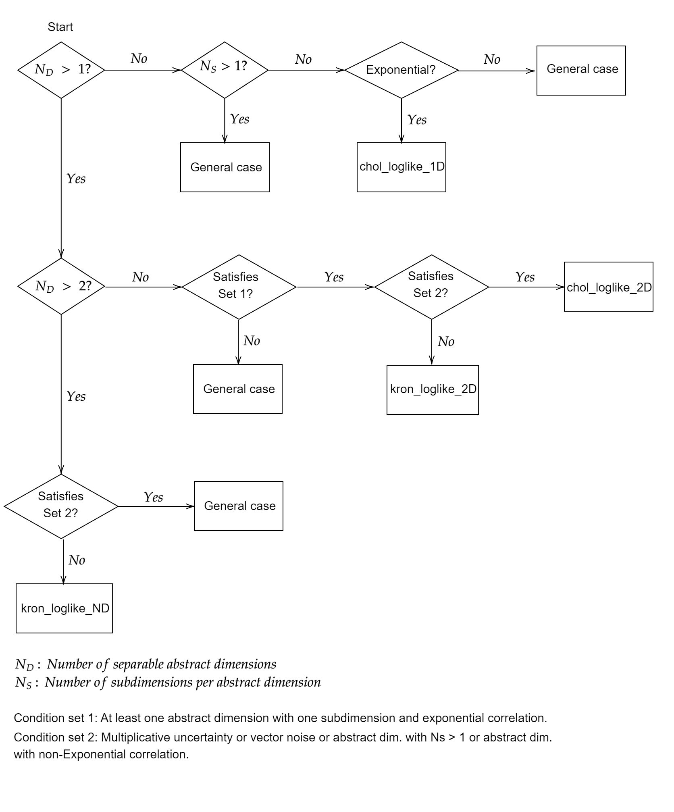

# tripy

A package for efficient[^1] likelihood evaluation and sampling for Multivariate Normal distributions where the covariance matrix:

* Is Separable, i.e. can be expressed as the [Kronecker product](https://en.wikipedia.org/wiki/Kronecker_product) of the covariance over different dimensions (e.g. space and time);
* May have Exponential correlation (i.e. [(block-) tridiagonal](https://en.wikipedia.org/wiki/Tridiagonal_matrix) precision matrix) in one or more dimensions;
* Is polluted with uncorrelated scalar or vector noise.

[^1]: In the general case, exact likelihood evaluation has *O(N3)* computational complexity and *O(N2)* memory requirements. The term "efficient" is used here to refer to the reduction of complexity and memory usage by utilizing the sparsity and Kronecker product structure of the covariance matrix.

## Structure
**base**: Base class for problem formulation, taken from [taralli](https://gitlab.com/tno-bim/taralli). Likely to be removed in a future update.

**utils**: Utility functions for efficient linear algebra invovling tridiagonal and Kronecker product matrices.

**loglikelihood**: Functions for efficient loglikelihood evaluation.

**kernels**: Formulation of commonly used kernels.

**sampling**: Functions for efficient sampling.

## Usage

## TODOs
* Validation of all functions against reference implementations.
* Documentation, including examples and timing tests.
* Unit and integration testing.
* Improve this README by including mathematical notation and references.
